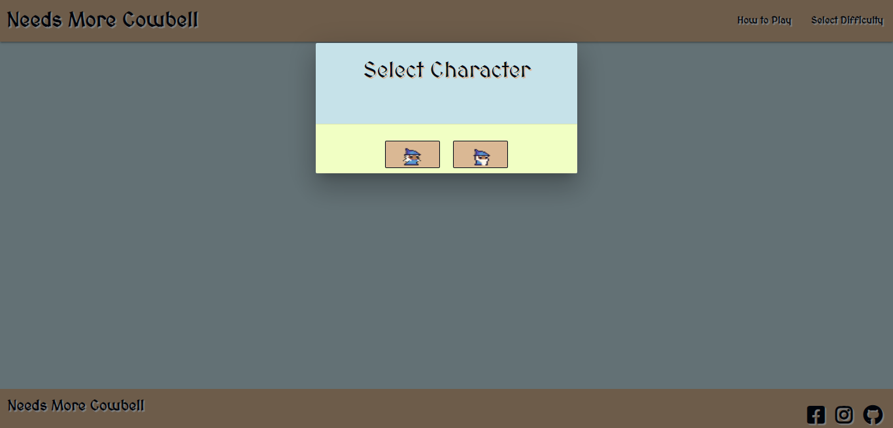
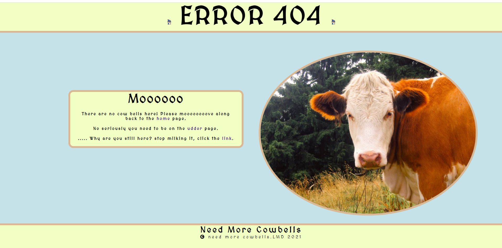

# Contents
* [Collaborators](#Collaborators)
* [UX](#UX)
    * [Strategy](#Strategy)
       * [Project Goals](#Project-Goals)
       * [User Stories](#User-Stories) 
    * [Structure](#Structure)
       * [Concept](#Concept)
       * [MVP](#MVP)
       * [Falling out of scope](#Falling-out-of-scope)
       * [Features](#Features) 
         * [Home Page](#Home-Page)
         * [Existing Features](#Existing-Features)
         * [Design](#Design)
    * [Skeleton](#Skeleton)
      * [Wireframes](#Wireframes)
      * [Technolgies Used](#Technologies-Used)
    * [Testing](#Testing)
    * [Deployment](#Deployment)
      * [Making a clone to run locally](#Making-a-clone-to-run-locally)
    * [Credits](#Credits)
      * [Media](#Media)
      * [Code](#Code)
      * [Acknowledgements](#Acknowledgements)

# Retro Gaming Hackathon

The live website can be viewed [here]()

# Collaborators

* [Andy](https://github.com/andywales83)

* [Anthony](https://github.com/auxfuse)

* [Aideen](https://github.com/AideenM12)

* [Charlie](https://github.com/charliehawley)

* [Craig](https://github.com/CraigThomasson)

# UX

## Strategy 

### Project Goals

The central goal is to create an interactive game with retro gaming themes and styles.  

**The Strategy for achieving the above goals is as follows:**
* Collaborate as a team
* Decide on a project game that appeals to the team.
* Build collaboratively based on the scope and skill set of the team.
* Explore all resources available and push our own skills set to get the maximum possible output whilst also creating an enjoyable collaborative atmosphere!
* Eat, Sleep, Hack, Repeat!

**The Ideal User of this site is :**
* Someone who enjoys gaming!
* Someone with a keen interest in building collaborative projects.
* Someone who enjoys the nostalgic feel of retro gaming!
* Someone with a keen interest in frontend development for interactive games/sites.

### User Stories

* As a first time user I want to play a game with intuitive UX design
* As a first time user I want to play a game thematically inspired by retro games. 
* As a first time user I want a fun medieval style platform game. 
* As a returning user I want to beat the game quicker than my last attempt.
* As a user I want the option to select the gender of my character.
* As a user I want a game with fun, unique audio. 

# Structure

## Concept

Initially we wanted to create a platform style game that would test the players platforming skills as well as their perception skills. To do this we would create a game that would ask the player question based on visual in the game. Correct answers would make the next level easer to complete. 

 

## MVP

* Create a basic platformer game that includes:
    * Game physics and collision.
    * With 3 playable levels.
    * Character selection.

## Falling out of scope

* During development of the game, we soon realised that we needed to make a choice between including the perception test mechanic and our team goal of allowing members to attempt to create a level of the game (in a new language for many of us).we could allow our lead Dev to work alone on new mechanics or he could use this time to walk us through to process of developing basic levels and coach us through this challenge. The team decided that hitting our MVP and all trying to work on a game level was the best way to move forward. 

* An original third modal was triggered when the user selects the "Start Game" button. This modal intended to allow the user to select their preferred mode of difficulty of gameplay. The user is presented with three options : Easy, Medium, Hard. This was deemed out of scope for this current project due to conflicts with the Phaser framework but will possibly be investigated at a later stage.

## Features

#### Home Page.

The home page gives a general overview of the content offered by the site. 

#### Main Menu
The main menu consists of a series of modals.
* The first modal is triggered when the user lands on the page. It provides the user with the option of viewing the game instructions or beginning the game immediately.

* The second modal is triggered when the user selects the "How to Play" button. This modal provides the user with a series of instructions on how to play the game. The user can then select the "Start Game" button.

* The third modal allows the user to select the gender of the character they would like to use. They are presented with two image buttons to choose from before beginning gameplay.

#### Credits page
* The Credits page showcases all the collaborators who worked together to make this project. Links to each individual collaborator's github page can be found on this page alongside a link to the main menu page. A link to the site repository can also be found on this page, many thanks to Andy for taking the time to work with [Materializecss](https://materializecss.com/) for the first time to create this page. 

#### 404 page

* This page exists to inform users that the page they are looking for does not exist.
Instead of using a generic 404 page we decided to ensure it's stylings keep to the same themes of the main pages and inject some of the team’s personality in it. That said personality being cow puns apparently.
* The page holds links that take us back to main game. Ensuring a 404 error does not lead to a loss in traffic to the game. 

 

### Design

**Typography**
The 'MedievalSharp' font was chosen to match the medieval aesthetic of the game. It was found on [Google fonts](https://fonts.google.com/).

**Colours**
The color palette was chosen using the https://coolors.co website. This particular palette was chosen for its simplicity and because the basic colours presented are redolent of those often found in retro PC games.

**Imagery**
 The imagery and graphics were chosen to recreate a medieval aesthetic in keeping with the goals from the user stories. Other imagery chosen was inspired by the game's uniquely original title. 

## Skeleton

### Wireframes

* The wireframes were created using [Balsamiq wireframes](https://balsamiq.com/)

* The wireframe mockup links can be found below:

* [Main-Menu Wireframes](assets/wireframes/main-menu.pdf)

## Technologies Used
- This project is built using HTML5 semantic markup, CSS stylesheets and Javascript.
- [Gitpod](https://gitpod.io)
    - This project was built using Gitpod as the IDE.
- [Google fonts](https://fonts.google.com/) 
    - The font styles used on this website were chosen from Google fonts.
- [Materializecss](https://materializecss.com/)
   - Various aspects of this website were structured using Materialize.
- [Animate.css](https://animate.style/)
    - Buttons, images and popups were animated using Animate.css.
- [Fontawesome](https://fontawesome.com/)
    - The icons used on this page were found in Fontawesome.
- [Phaser.io](https://phaser.io/)
    - Phaser.io was the core framework used to develop gameplay.
- [Balsamiq](https://balsamiq.com/)
    - The wireframes for this project were created using Balsamiq.
- [Unsplash](https://unsplash.com/)
    - The majority of images used in this project were found in Unsplash. 
- [Freeformatter- CSS beautifier](https://www.freeformatter.com/css-beautifier.html)
    - This was used to format the CSS stylesheet.
- [Freeformatter- HTML formatter](https://www.freeformatter.com/html-formatter.html)
    - This was used to format each HTML page
- [Google DevTools](https://developers.google.com/web/tools/chrome-devtools) 
    - Google Dev Tools was extensively used throughout the project for various styling and testing purposes. Its lighthouse feature was used as one of the main testing tools for this project.
- [Github](https://github.com/AideenM12/retro-gaming-hackathon)
    - Github pages was used to to publish a live version of this game following deployment.
    - Github was used to remotely store this game. 

## Testing
Testing information can be found here in the separate [TESTING.md file](TESTING.md)

## Deployment
This project was developed using [Gitpod IDE](https://gitpod.io) and pushed to Github using the in-built terminal.

This project was deployed from the [Github Respository](https://github.com/AideenM12/retro-gaming-hackathon) to GitHub Pages using the following steps:

1. Log into Github.
2. Select the [AideenM12/retro-gaming-hackathon](https://github.com/AideenM12/retro-gaming-hackathon) respository.
3. Click the settings tab.
4. Scroll to the GitHub Pages section of the page.
5. Under the source heading select the *master* branch option.
6. Click save.
7. The project has now been deployed. Scroll back to the GitHub pages section and click on the link above the source heading to view the live site.

### Making a clone to run locally

1. Log into GitHub.
2. Select the [respository](https://github.com/AideenM12/retro-gaming-hackathon).
3. Click the Code dropdown button next to the green Gitpod button.
4. Download ZIP file and unpackage locally and open with IDE. Alternatively copy the URL in the HTTPS box.
5. Open the alternative editor and terminal window.
6. Type 'git clone' and paste the copied URL.
7. Press Enter. A local clone will be created.  

## Credits

* 404 cow img from https://pikwizard.com/photo/brown-and-white-cow/a23d59de9a85b648a35c5a97e689d139 

### Media

* Custom audio was created by collaborator [Charlie](https://github.com/charliehawley)

### Code

* All code used is an original creation of this site's collaborators.

* [Stack Overflow](https://stackoverflow.com/) was used as a general resource for general issues and obstacles.  

### Acknowledgements

* We would like to thank our esteemed facilitator [Kevin Ci](https://github.com/kevin-ci).

* We also like to thank the fantastic Jim Community Ci for all his help and support during the course of this Hackathon.

* We would also like to thank Atlas, hope the beach is good!

