# Contents

   * [Testing User Stories](#Testing-User-Stories)
   * [Validators](#Validators)
   * [Testing Features](#Testing-Features)
        * [Game Functions](#Game-Functions)
        * [Social Media Links](#Social-Media-Links)
        * [Buttons and Modals](#Buttons-and-Modals)
        * [404 Page](#404-Page)
   * [Device Testing](#Device-Testing)
   * [User Testing](#User-Testing)
   * [Known Bugs and Issues](#Known-Bugs-and-Issues)
   * [Further Testing](#Further-Testing) 

## Testing User Stories

### Test Case 1.

1. As a first time user I want to play a game with intuitive UX design

**Description**
Verify that the game's UX is intuitive.

**Steps**
1. Open one's internet browser of choice.
2. Navigate to [https://motherfolklore.herokuapp.com/](https://motherfolklore.herokuapp.com/)
3. A modal will appear offering the user the choice to read gameplay instructions or begin the game.
4. If the user selects the "How to Play" button a modal with a list of game play instructions appears and also a button to start the game.
5. Once the user has selected the start game button a modal will appear to ask the user to select the gender of their character. 
6. Once the character has been selected game play will begin.
7. These options are also available in the navigation bar for ease of use.

**Expected Result:**
The user will navigate to the site's gameplay with ease.

**Actual Result:**
The user can navigate to the site's gameplay with ease.

**Pass/Fail:**
Pass

**Image of Test Result:** 

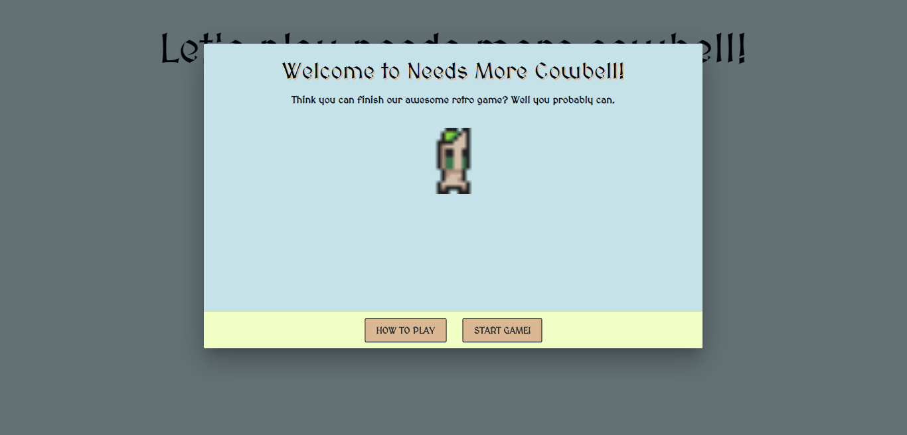

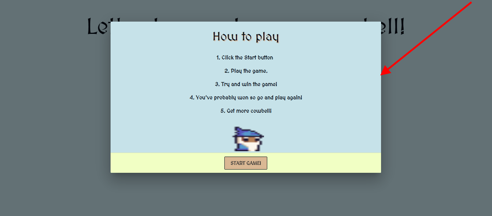

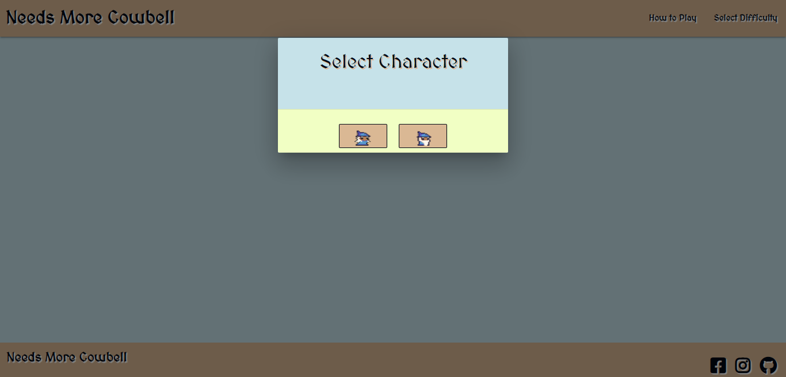 

        
### Test Case 2.

2. As a first time user I want to play a game thematically inspired by retro games.

**Description**
Verify that the game is inspired by retro games.

**Steps**
1. Open one's internet browser of choice.
2. Navigate to [https://motherfolklore.herokuapp.com/](https://motherfolklore.herokuapp.com/)
3. A modal will appear offering the user the choice to read gameplay instructions or begin the game.
4. Observe the retro style graphics and game play that have been implemented to fulfill this task. 
5. Observe the custom audio that has been implemented to further enhance the retro feel of the game. 

**Expected Result:**
The user will be presented with a game that has a similar gameplay and aesthetic to that of retro games.

**Actual Result:**
The user is presented with a game that has a similar gameplay and aesthetic to that of retro games.

**Pass/Fail:**
Pass

### Test Case 3.    

3.  As a first time user I want a fun medieval style platform game.

**Description**
Verify that the game is a platform game with a medieval style and aesthetic.

**Steps**
1. Open one's internet browser of choice.
2. Navigate to [https://motherfolklore.herokuapp.com/](https://motherfolklore.herokuapp.com/)
3. Begin gameplay.
4. Observe the medieval dungeon setting coupled with the medieval wizard characters. 
5. Observe the platform format in which the game has been presented.
6. Observe the custom audio designed to complement this game thematically.

**Expected Result:**
The user will be presented with a platform game with a medieval style and aesthetic.

**Actual Result:**
The user is presented with a platform game with a medieval style and aesthetic.

**Pass/Fail:**
Pass

**Image of Test Result:** 

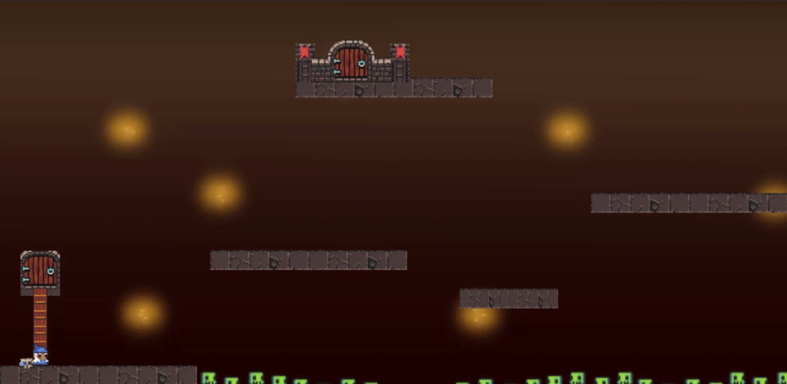

### Test Case 4. 

4. As a returning user I want to beat the game quicker than my last attempt.

**Description**
Verify that the user has the option of replaying the game.

**Steps**
1. Open one's internet browser of choice.
2. Navigate to [https://motherfolklore.herokuapp.com/](https://motherfolklore.herokuapp.com/)
3. Begin gameplay.
4. Continuing playing the game for as long as desired

**Expected Result:**
The user will be able to play the game as much as they wish.

**Actual Result:**
The user is able to play the game as much as they wish.

**Pass/Fail:**
Pass

    
### Test Case 5.

5. As a user I want the option to select the gender of my character.

**Description**
Verify that the user has the option of selecting the gender of their character.

**Steps**
1. Open one's internet browser of choice.
2. Navigate to [https://motherfolklore.herokuapp.com/](https://motherfolklore.herokuapp.com/)
3. Click the 'Start Game' button
4. Choose the gender of your character in the pop up modal.

**Expected Result:**
The user will be able to select the gender of their character.

**Actual Result:**
The user is able to select the gender of their character.

**Pass/Fail:**
Pass

**Image of Test Result:** 

 

### Test Case 6
  
6. As a user I want a game with fun, unique audio. 

**Description**
Verify that the game has it's own custom unique audio.

**Steps**
1. Open one's internet browser of choice.
2. Navigate to [https://motherfolklore.herokuapp.com/](https://motherfolklore.herokuapp.com/)
3. Begin gameplay.
4. Observe the custom audio designed to complement this game thematically.

**Expected Result:**
The user will be presented with a platform game with it's own custom audio.

**Actual Result:**
The user is presented with a platform game with it's own custom audio.

**Pass/Fail:**
Pass

## Validators

### HTML 
All of the following HTML pages were validated by using [W3C Markup Validation Service](https://validator.w3.org/).

— **HTML Pages** —
* **Index Page** &#40; `index.html` &#41;:

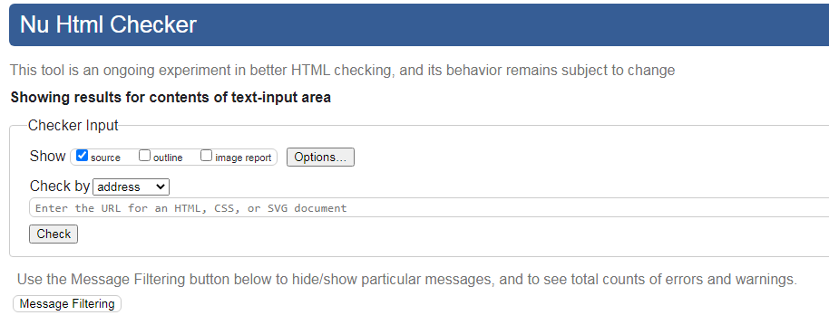

* **Game Over Page** &#40; `game-over.html` &#41;:

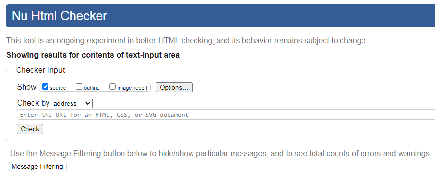

* **Credits Page** &#40; `credits.html` &#41;:

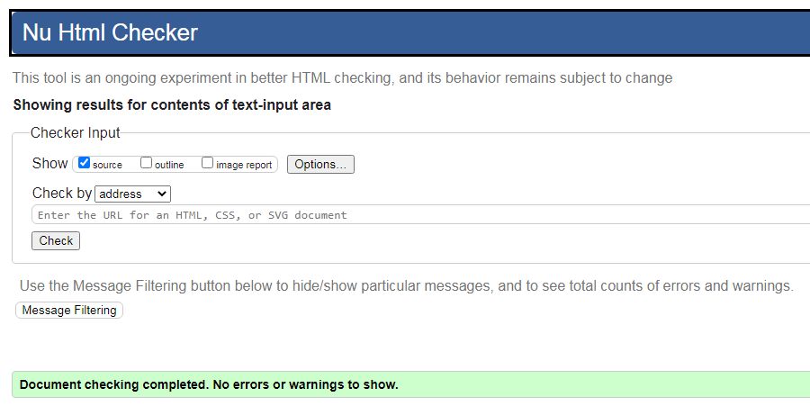

* **404 Page** &#40; `404.html` &#41;:

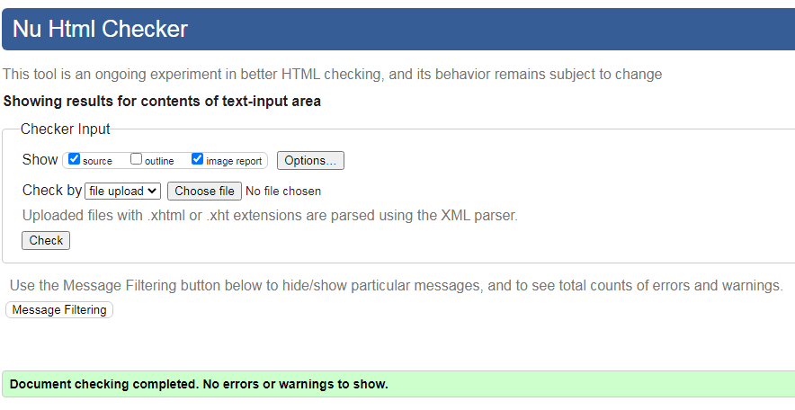

* **Level 1 Page** &#40; `level-1.html` &#41;:

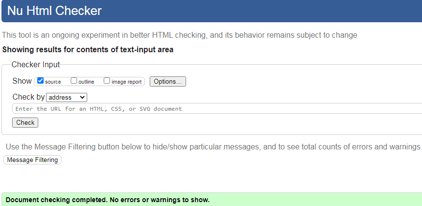

* **Level 4 Page** &#40; `level-4.html` &#41;:

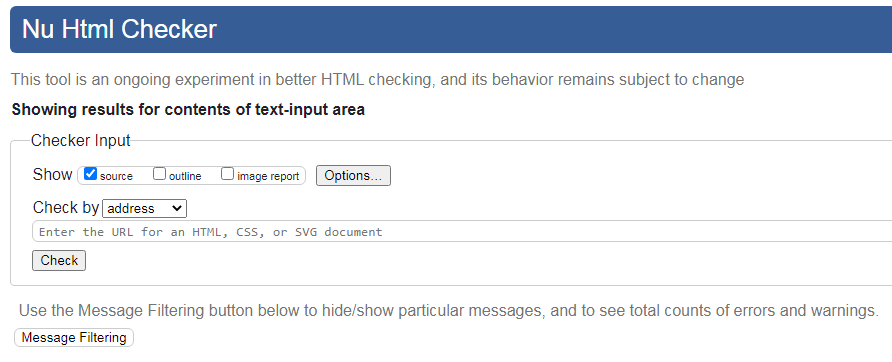

### CSS
All CSS was validated by using [W3C Jigsaw CSS Validation Service](https://jigsaw.w3.org/css-validator/) with no issues detected. A screenshot of these results can be seen below:

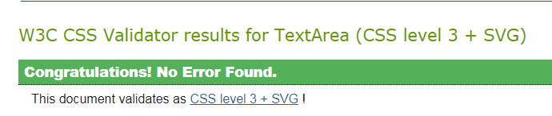

### Javascript
* All Javascript code was passed through the [JShint](https://jshint.com/) validator with little to no issues with the exception of 'let' being available in ES6 and the '$' being recognised as an unused variable. Screenshots of the results of these files can be found below:

* **main.js file**

## Testing Features

 ### Game functions

 ### Social Media links
 * When the facebook icon is clicked, ensure that the user is brought to the facebook homepage in a new tab.
 * When the instagram icon is clicked, ensure that the user is brought to the instagram homepage in a new tab.
 * When the twitter icon is clicked, ensure that the user is brought to the twitter homepage in a new tab.
 * Testing was done to ensure all Social media links functioned as expected and opened in new at the time of submission.

  
 

 ### Buttons and Modals
 * Ensure that all buttons and modals are functioning as expected and meet users expectations.
 * Testing was done to ensure that all buttons and modals were functioning as desired and as a potential user would   expect. All buttons and modals functioned as desired at the time of submission. 

 ### 404 Page
 * Ensure that there is a functioning 404 page that allows users to navigate back to the home page.
 * Testing was done to ensure that there was a functioning 404 page that allowed the user to easily navigate back to the home page at the time of submission.

 

## Device Testing
* The website was primarily tested on the following devices:

    - Hp Pavilion g series laptop
    
    - HP 250 G6 Notebook PC 
    

## User Testing

## Known Bugs and Issues

* No bugs were detected at the time of submission.

## Further Testing

* Testing was performed in the following browsers on both laptop devices:
    - Google Chrome

    - Mozilla Firefox

    - Opera 

    - Microsoft Edge

    No issues were detected in any of these browsers at the time of submission.
